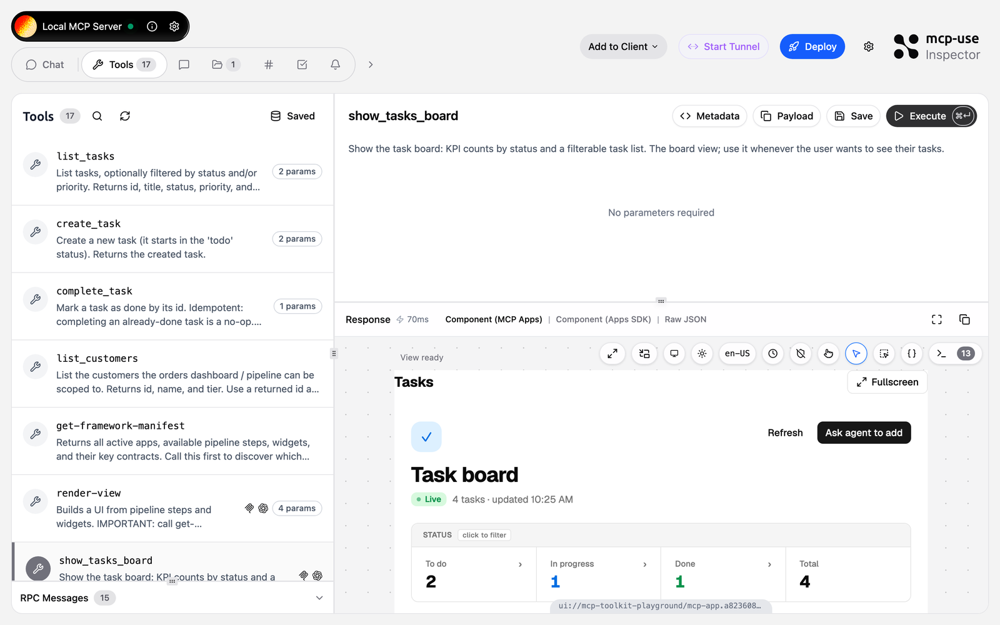
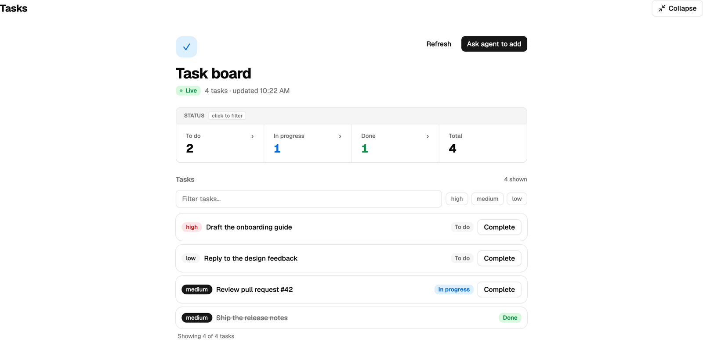
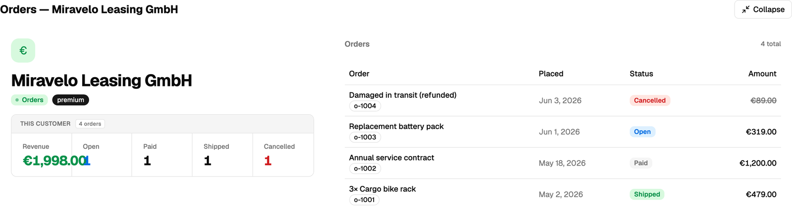
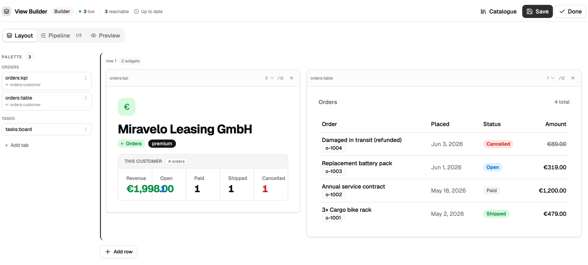

# Guided tour

Seven stops through the toolkit's feature surface. Run each call in the
inspector's **Tools** tab — pick a tool on the left, fill the arguments, hit
**Execute**. Widget tools render their result inline; plain tools return
`structuredContent` JSON. First [connect](index.md#connect) to the playground.



The demo data is seeded and shared: two customers (**Miravelo Leasing GmbH**,
**Nordwind Logistik**) and four tasks. Anything you create or complete sticks
until the machine restarts.

## 1. Discover the contract

Call `get-framework-manifest` with `{}`. One payload describes everything the
rest of the tour uses — the steps, the widgets, and the **key contracts** that
wire them together:

```jsonc
{
  "steps": [
    { "id": "orders:resolve-customer", "produces": ["orders:customer"] },
    { "id": "orders:list-customer-orders", "requires": ["orders:customer"] },
  ],
  "widgets": ["tasks:board", "orders:kpi", "orders:table"],
  "keyContracts": [
    {
      "key": "orders:customer",
      "producedBy": ["orders:resolve-customer"],
      "consumedBy": ["orders:list-customer-orders"],
    },
  ],
}
```

Notice `orders:list-customer-orders` **requires** the exact key
`orders:resolve-customer` **produces** — that shared key is the pipeline in
stop 5.

Reading: [architecture](../concepts/architecture.md) ·
[pipelines & steps](../concepts/pipelines-and-steps.md)

## 2. Plain tools

`list_tasks` is a domain tool built with `createToolRegistrar` — Zod-described
args, an `outputSchema`, read-only annotations. Call it with `{}` for all four
seeded tasks, then narrow it with a filter:

```json
{ "status": "todo" }
```

Two come back — _Draft the onboarding guide_ (high) and _Reply to the design
feedback_ (low). Now mutate the store. Add one with `create_task`:

```json
{ "title": "Try the mcp-toolkit playground", "priority": "high" }
```

and close one with `complete_task` (grab an id from `list_tasks` first):

```json
{ "taskId": "t-2" }
```

`complete_task` is idempotent — call it twice and the second call is a no-op,
not an error.

Reading: [app plugins](../concepts/app-plugins.md)

## 3. A tool that renders a widget

Call `show_tasks_board` with `{}`. Same store as stop 2, but the result now
carries `_meta.ui` and a view envelope, so the inspector renders it as a live
widget — the task you added and the one you completed are both on it:



In the JSON, `structuredContent.context.stepData.result._dataType` is
`"tasks:board"` — that tag is how the bundled widget finds its data.
`buildSingleWidgetView` builds this envelope.

Reading: [widgets](../concepts/widgets.md)

## 4. A composed view

Call `list_customers` with `{}` — you get **c-1** (Miravelo Leasing GmbH,
premium) and **c-2** (Nordwind Logistik, standard). Feed one to
`show_orders_dashboard`:

```json
{ "customerId": "c-1" }
```

One tool call, one view, **two** widgets — a KPI strip (span 5) and an orders
table (span 7) on the 12-column grid:



Both `stepData` entries carry `_dataType: "orders:dashboard"` with the _same_
object; each widget renders its own slice (`orders:kpi` reads the totals,
`orders:table` reads the rows). This is `buildComposedView`, the recommended
default for multi-widget views. Re-run it with `"customerId": "c-2"` to watch
the whole view re-scope to Nordwind's single order.

Reading: [layout & rendering](../guides/layout-and-rendering.md)

## 5. A real pipeline

Stop 4 computed both widgets up front. The advanced path, `render-view`, chains
steps whose inputs depend on earlier outputs. Call `render-view` with:

```json
{
  "keys": { "orders:customerId": "c-1" },
  "steps": [
    { "id": "customer", "step": "orders:resolve-customer" },
    { "id": "orders", "step": "orders:list-customer-orders" }
  ],
  "layout": {
    "rows": [
      {
        "row": [
          { "widget": "orders:kpi", "span": 5 },
          { "widget": "orders:table", "span": 7 }
        ]
      }
    ]
  },
  "title": "Orders pipeline view"
}
```

The rendered view looks identical to stop 4 — but it was computed by a two-step
chain. The proof is in `context.keys` on the result:

```json
{ "orders:customerId": "c-1", "orders:customer": {}, "orders:orderList": {} }
```

You passed only `orders:customerId`. `orders:customer` appeared because step A
produced it; `orders:list-customer-orders` then ran because that key satisfied
its `requires`, producing `orders:orderList`. The gate _is_ the chaining.

Reading: [pipelines & steps](../concepts/pipelines-and-steps.md)

## 6. Break it — fail-soft

Repeat stop 5 with one change — an id that doesn't exist:

```json
{
  "keys": { "orders:customerId": "does-not-exist" },
  "steps": [/* … as above … */],
  "layout": {/* … */}
}
```

The call still **succeeds**. Step A can't resolve the customer, so it records an
error and never produces `orders:customer`; step B is skipped because its
required key never appeared. `context.errors` tells the story and `stepData` is
empty:

```json
{
  "errors": [
    { "stepId": "customer", "reason": "Unknown customer id: \"does-not-exist\"." },
    { "stepId": "orders", "reason": "Missing required keys: orders:customer" }
  ]
}
```

Pipelines degrade per-step instead of crashing the request.

Reading: [debugging pipeline steps](../recipes/debugging-pipeline-steps.md)

## 7. Builder & dashboards

The playground boots with `app.builder: true`, so the pipeline view from stop 5
carries a **Build** affordance (the eager view from stop 4 doesn't — only
pipeline-rendered views carry the refresh params the builder re-runs). Open it
and you get the in-iframe visual builder, fed by `get-builder-catalogue`:



Drag widgets from the palette, resize their column spans, switch to the
**Pipeline** tab to wire steps — no round-trip through the LLM. **Save** persists
through the dashboard CRUD tools, which you can also drive directly:
`save-dashboard` with the keys/steps/layout from stop 5, then `list-dashboards`,
then `load-dashboard` — whose result feeds straight back into `render-view`. A
saved dashboard is a callable view.

(Dashboards live in the in-memory store — gone on restart, like everything
here.)

Reading: [view builder](../concepts/view-builder.md) ·
[building dashboards](../guides/building-dashboards.md)

## That's the tour

You've touched every layer: domain tools, a single-widget view, an eager
composed view, a real pipeline, fail-soft execution, and the builder. To build
your own, start with [getting started](../getting-started.md);
to run this host locally, see the [overview](index.md).
